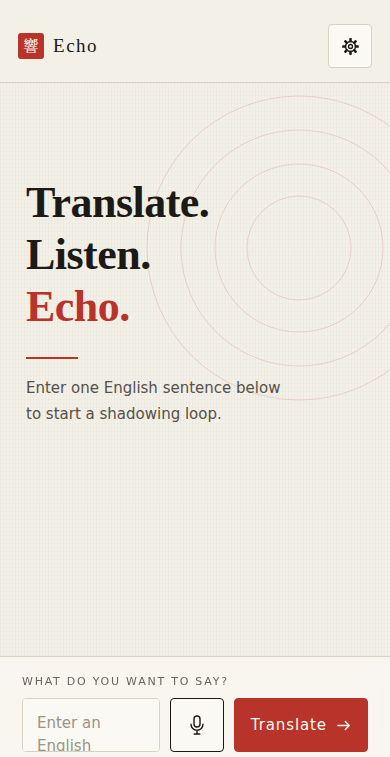
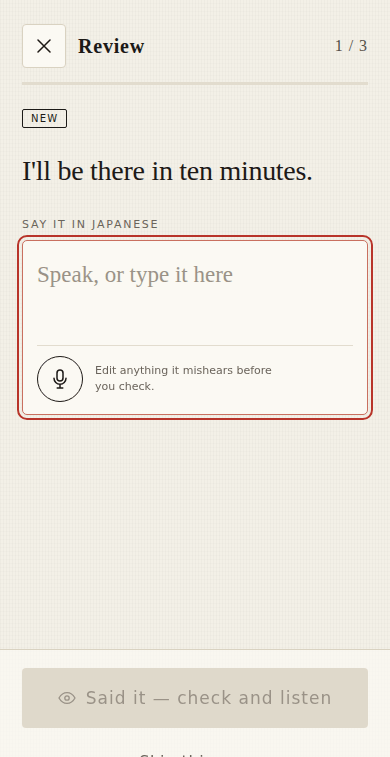
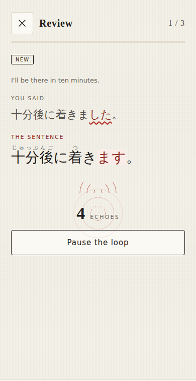

# Echo

An offline-first PWA for turning an English sentence into Japanese and learning
it through a listen–imitate shadowing loop.

**[Open the app](https://echo.kakkoi.dev/)** ·
[About Echo](https://echo.kakkoi.dev/docs/)

| Practice | Review | The difference |
|---|---|---|
|  |  |  |

More screens, including dark and desktop, are in [`docs/screenshots`](docs/screenshots).

## Privacy and boundaries

- Provider keys are stored only in the user's browser and are never included
  in an export.
- The library lives in IndexedDB and can be exported/imported as JSON.
- The shadowing loop never opens the microphone.
- Dictation — in the composer, or when answering a review — uses the browser's
  own speech recognition, so that audio is handled by the browser's maker.
  Echo neither records nor stores it.
- Device speech synthesis produces audio on demand; no audio file is stored.
- History can be exported on-device as a standard `JP Echo.apkg` Anki deck.
- Every translated sentence enters an offline FSRS review queue immediately.
- Map counts the 2,136 joyo kanji against your own library. It is derived on
  the device from the sentences you already have, each time the view opens, so
  nothing about it is stored, scheduled or sent. Only sentences are reviewed.
  The character list and grade bands come from `joyo-kanji` and `kyoiku-kanji`,
  both MIT; `tools/build-kanji-data.mjs` regenerates `kanji-data.js` from them.
- WaniKani meanings, readings, mnemonics and example sentences are optional and
  fetched with your own read-only token, into this browser, into a database of
  their own. Nothing of WaniKani's is bundled or redistributed. The token is
  stored outside the settings object, so it cannot appear in a backup, and the
  mnemonics are passed through a small word list on the way in (`SCRUB` in
  `wanikani.js`) that replaces a few exclamations.
- Reminders are optional, at most one a day, and only when something is due.
  Echo has no server, so nothing is pushed: where the browser supports Periodic
  Background Sync the worker is woken to check, and everywhere else the check
  runs when the app is opened. Settings says which applies on the device in
  front of you rather than promising either.
- A review shows the English, takes the Japanese you say back, marks the
  difference, and then grades on Again or OK (Anki Good).
- Anki exports include JP Echo's repetitions, lapses, interval, and due date.
- A configurable proxy is supported for browsers where DeepSeek blocks direct
  cross-origin requests. Proxy implementation and hosting remain external.

## JP Core

core.js is JP Core's `browser/jp-core.js`, copied: the furigana notation, safe
ruby rendering, reading alignment, the sentence schema, and the merge rules.
Everything below the language list is verbatim, and the list itself is the one
local addition — which languages the dropdown offers is an application choice,
not a Japanese one. diff.js and the rest read the notation through core.js
rather than reimplementing it.

Change these rules in JP Core first and bring the copy over in the same change.
The synchronized JP Core revision is
`c84048782e545420dd7b7b62d2556789cd8d6f98`.

## Layout

    index.html app.js styles.css   the app itself
    core.js diff.js srs.js db.js   sentence rules, the answer diff, scheduling, storage
    api.js speech.js reminders.js  translation, the loop and dictation, due reminders
    sw.js manifest.webmanifest     offline shell and install
    docs/                          the landing page, published beside the app
    tools/                         one-off scripts that draw the identity assets

## Development

    npm test
    npm run check

Serve the directory over HTTP to exercise service workers, microphone
permissions, IndexedDB, and PWA installation.
