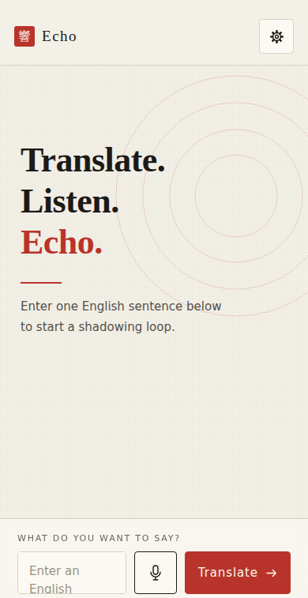
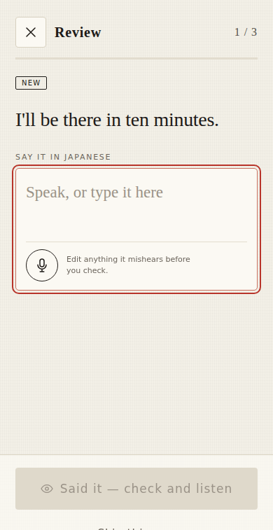
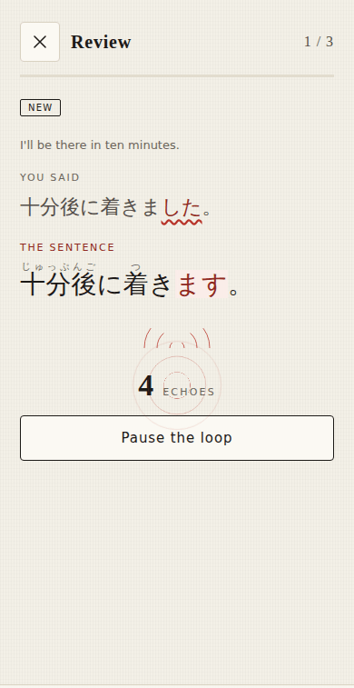

# Echo

An offline-first PWA for turning an English sentence into Japanese and learning
it through a listen–imitate shadowing loop.

**[Open the app](https://echo.kakkoi.dev/)** ·
[About Echo](https://echo.kakkoi.dev/docs/)

| Practice | Review | The difference |
|---|---|---|
|  |  |  |

More screens, including dark and desktop, are in [`docs/screenshots`](docs/screenshots).

## Privacy and boundaries

- Provider keys are stored only in the user's browser and are never included
  in an export.
- The library lives in IndexedDB. A backup file can be exported; a backup or
  a deck can be imported from a file or a URL (importing merges; nothing
  already on the device is lost). Backups never
  contain any key — translation or speech.
- Optional automatic backup to a **secret GitHub gist** (Settings → Your
  sentences), the same approach as webmods/annotate: one `echo-backup.json` in
  one gist, updated in place. A change marks the library dirty; it is uploaded
  after two quiet minutes, at most every five, and when the app is left or
  reopened with changes pending. The GitHub token stays in this browser and,
  like the gist URL, is never written into any backup. Secret gists are
  unlisted, not private: anyone with the URL can read them. **Restore from
  gist** merges, and needs only the URL on a new device.
- The shadowing loop never opens the microphone.
- Dictation — in the composer, or when answering a review — uses the browser's
  own speech recognition, so that audio is handled by the browser's maker.
  Echo neither records nor stores it.
- Device speech synthesis produces audio on demand; no audio file is stored.
- History can be exported on-device as a standard `Echo.apkg` Anki deck.
- Every translated sentence enters an offline FSRS review queue immediately.
- Map counts the 2,136 joyo kanji against your own library. It is derived on
  the device from the sentences you already have, each time the view opens, so
  nothing about it is stored, scheduled or sent. Only sentences are reviewed.
  The character list and grade bands come from `joyo-kanji` and `kyoiku-kanji`,
  both MIT; `tools/build-kanji-data.mjs` regenerates `kanji-data.js` from them.
  Readings, meanings and the current school grade for each come from
  `kanji-readings.js`, derived from KANJIDIC2 (© EDRDG, CC BY-SA 4.0); that
  licence is that file's, and `tools/build-kanji-readings.mjs` regenerates it.
- Words are a dictionary on the device: the common words of JMdict — the
  ones it marks as frequent in print — and every word on a JLPT list, about
  23,000 in all, with readings, senses and the part of speech. Search by
  kana, romaji, a kanji, or English; every word opens a sheet with your
  sentences that use it, a place to say one, Echo writing one on request, and
  a way to remember it, also on request, kept in your notes and every backup.
  `words-data.js` is derived from JMdict (© EDRDG, CC BY-SA 4.0); that licence
  is that file's, and `tools/build-words-data.mjs` regenerates it from
  `data/jmdict/JMdict_e.gz` (download it from EDRDG; the directory is
  gitignored) and the JLPT lists under `tools/jlpt-vocab` (Jonathan Waller's,
  via elzup/jlpt-word-list, MIT). Whether a sentence uses a word is read off
  its written form and, for a verb or adjective, its stem — there is no
  parser — so the count is honest but not exact.
- Nothing of WaniKani's is bundled, redistributed, or shown in the app. It is
  a reference you rework from, once, on your own machine:
  `tools/wanikani-pull.mjs` writes your subjects to `data/wanikani/subjects.json`
  with `WANIKANI_TOKEN` from the environment — official API, one page at a
  time, passed through a small word list (`SCRUB` in `wanikani.js`). That
  directory is gitignored: it is the reference you rewrite from, not something
  this public repository carries. What you write from it is yours.
- `tools/rewrite-stories.mjs` is the writing. Given the facts — meanings and
  readings from KANJIDIC2, the parts from the pull — it has the model write an
  original story per kanji, with WaniKani's shown for structure only (or not
  at all, with `--fresh`), and no religious reference or swearing by rule.
  The result is `stories.js`, shipped and shown on the sheet above the
  reference. Those stories are Echo's.
- Grammar points come as a table of contents, not content. `tools/bunpro-
  structure.js` runs in your own browser on your own Bunpro index page and
  reads names and levels only — it never opens a grammar point, so it cannot
  reach an explanation, an example or audio. `tools/build-grammar-data.mjs`
  turns that into `grammar-data.js` and refuses any input carrying more than a
  name, a level and a short gloss. Echo writes its own sentences on top.
- Reminders are optional, at most one a day, and only when something is due.
  Echo has no server, so nothing is pushed: where the browser supports Periodic
  Background Sync the worker is woken to check, and everywhere else the check
  runs when the app is opened. Settings says which applies on the device in
  front of you rather than promising either.
- A review shows the English, takes the Japanese you say back, marks the
  difference, and then grades on Again or OK (Anki Good).
- Anki exports include Echo's repetitions, lapses, interval, and due date.
- A configurable proxy is supported for browsers where DeepSeek blocks direct
  cross-origin requests. Proxy implementation and hosting remain external.

## JP Core

core.js is JP Core's `browser/jp-core.js`, copied: the furigana notation, safe
ruby rendering, reading alignment, the sentence schema, and the merge rules.
Everything below the language list is verbatim, and the list itself is the one
local addition — which languages the dropdown offers is an application choice,
not a Japanese one. diff.js and the rest read the notation through core.js
rather than reimplementing it.

Change these rules in JP Core first and bring the copy over in the same change.
The synchronized JP Core revision is
`b6956d9fbc5fb454e4516b1d67537faf8c1c3467`.

## Layout

    index.html app.js styles.css   the app itself
    core.js diff.js srs.js db.js   sentence rules, the answer diff, scheduling, storage
    api.js speech.js reminders.js  translation, the loop and dictation, due reminders
    sw.js manifest.webmanifest     offline shell and install
    docs/                          the landing page, published beside the app
    tools/                         one-off scripts that draw the identity assets

## Development

    npm test
    npm run check

Serve the directory over HTTP to exercise service workers, microphone
permissions, IndexedDB, and PWA installation.

## Rewrite a library sentence

Open Library → choose a sentence → Edit → Rewrite with AI. Type or dictate
directions using the same microphone and language switch as the other inputs.
Ask for a shorter sentence, only its first/second part, or a particular word.
Review the generated sentence and updated meaning, then Save; Cancel keeps the
original. Both registers update together and existing review history is retained.

## Dictionary lookup in sentences

Tap a vocabulary word in sentence details, practice, readings, conversation
turns, revealed reviews or study examples to open its dictionary
sheet. (A library row is one tap target: it opens the sentence.) Ruby readings and inflection endings share the same action. Ambiguous
kana spellings offer their dictionary meanings; unknown katakana words and names
stay whole, with an optional AI explanation using the current sentence context.
The linguistic matcher is JP Core’s `browser/japanese-words.js`, copied unchanged.

## Grammar in sentences

On a sentence's page, **Explain the grammar** makes one AI request. The answer
is kept with the sentence and shown as a numbered list (一 二 三…): each point's
phrase as it appears, its JLPT level and a short gloss; a row opens the grammar
sheet. In the sentence, words you can look up have a grey dotted underline and
grammar a heavier vermilion one; a key line under the meaning says which is
which. The same list appears on the revealed review answer, which never asks.
Without a key, or offline, the action stays visible but disabled with the
reason. With *Read new sentences for grammar automatically* on, new sentences
get the same analysis in the background. Only known IDs with exact quoted
evidence are accepted.

### Review skills

Each sentence takes turns being **聴 heard**, **読 read** and **書 written**, one
skill per visit, and moves to the next skill when it is graded OK (Again keeps
the skill). The card says which skill and why, from the sentence's own track.

### Settings

Settings is a page — `/settings`, with sub-pages `/settings/ai`, `speech`,
`backup`, `import`, `export` and `grammar` — not a dialog. Preferences are
saved as you change them; keys and endpoints only when you press their Save.

### Decks, and the starter seed

Settings → Your sentences → **Import** takes a deck file or a deck URL (or an
Echo backup) and merges it. **[DECK-FORMAT.md](DECK-FORMAT.md) is the format**,
written so an AI agent can produce a valid deck from it, with a complete
[example deck](decks/example-deck.json) and a [JSON Schema](decks/deck.schema.json).
Echo bundles no decks. The one built-in option is a seed:
Settings → Your sentences → **Starter sentences**, also offered on an empty
Library, adds ミニ本語 Minihongo's 262 example sentences from
`KakkoiDev/minihongo/master/imports/jp-echo.json` (Japanese targets only).
Once added they are ordinary sentences. The bundle may include
`catalogues.words` and `catalogues.grammar` (`minihongo:` IDs), which are
backed up with sentences.

Vocabulary, kanji and grammar sheets all accept sentence ideas or directions using the same language switch and microphone composer. AI creates a sentence using the chosen item and checks it before saving.

The service worker installs and serves a complete app version together. It serves the app shell for offline deep links, preserves reminder preferences on upgrades, and registers before module startup so an outdated installed app can recover. JP Core owns the content identity/merge helpers, mirrored in `core.js`.

Starter-import JP Core revision: ee9bfdb8a5b3fc38903ef6fcbcd50fa65d75bdf3.

### Compact ミニ本語 Minihongo starter (v2)

The starter contains 274 cards: the 231 main vocabulary entries as words/glosses, plus one short authored example per each of 43 grammar points. Advanced vocabulary, compounds, expressions, stories and extra examples are excluded.

On the first v119 launch, Echo archives and removes only recognizable v1 Minihongo import cards, restores the personal library, and strips imported-only dictionary links. Existing personal IDs, content and review progress remain intact. Settings shows the removed/kept counts and an **Undo Minihongo cleanup** recovery action. No new starter cards are added during cleanup; import the compact bundle separately when wanted. Old oversized starter files are rejected.

## Correcting existing furigana
On opening Echo, all Japanese sentences receive an offline dictionary pass and
a contextual reading check using the configured translator. Both registers are
checked; completed records are skipped on subsequent opens. Settings → Your
sentences shows progress and a Resume button. Interrupted or failed requests
resume on the next open, without navigating away from the current page.
The original readings are retained as `furiganaRecovery` in exported backups.
Sentence text, meanings, review history, identity and scheduling stay unchanged.
Manual reading corrections in the sentence editor become `readingOverrides`
and are retained in subsequent checks. Unknown names still require human
judgment: a model check is not a guarantee of a correct name pronunciation.

`japanese-readings.js` is copied from JP Core's browser distribution (only its
module import path differs). `readings.js` supplies Echo's dictionary and the
resumable backfill; the model request and persistence remain Echo-owned.
All playback modes speak the same reading annotations displayed on screen.

Shared reading helper revision: `78a5fa3661292be083b07775e9c3d0e59e4f75e0`.

Review session limits are saved on this device from Settings → Every day → Review limits. New cards and existing reviews each default to 20 per session; either can be set to any nonnegative whole number, including 0. Learning and relearning count toward the existing review limit. Excess due cards stay available for the next session.
